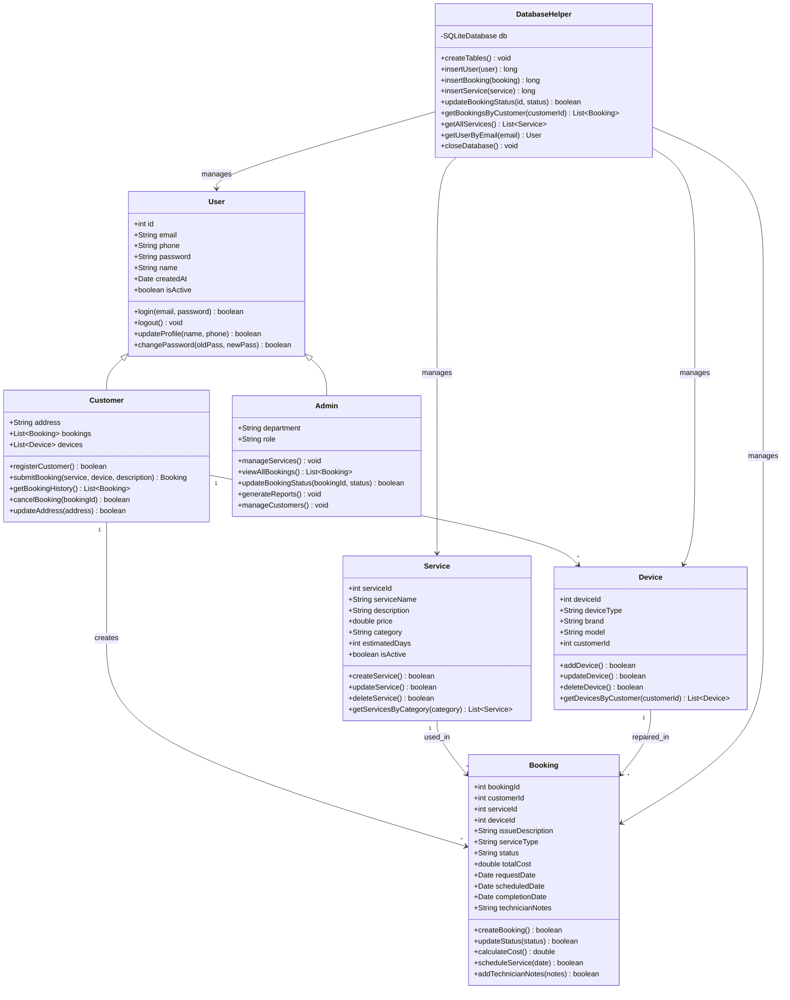
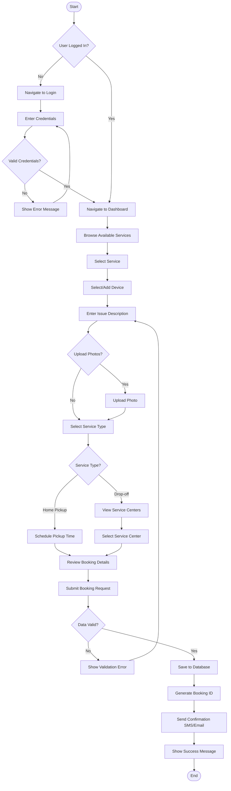
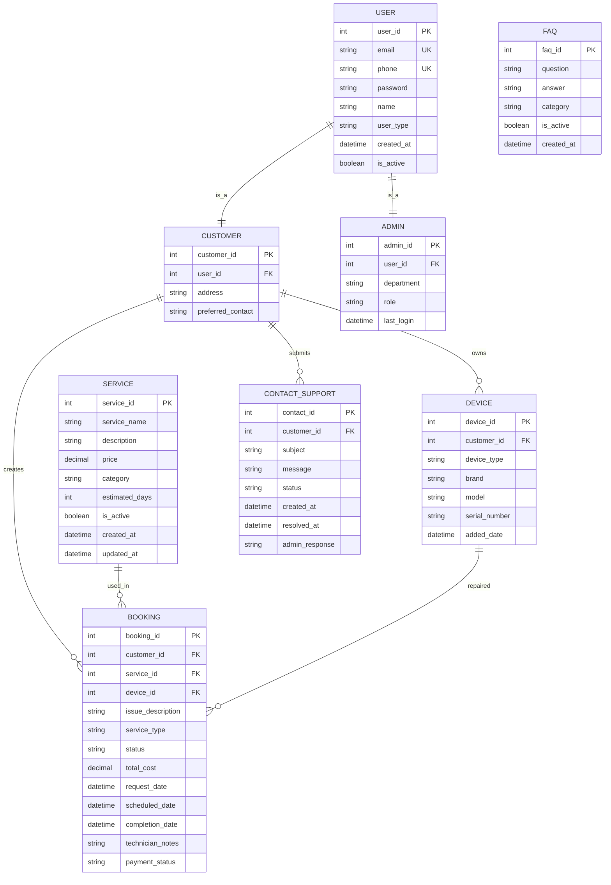
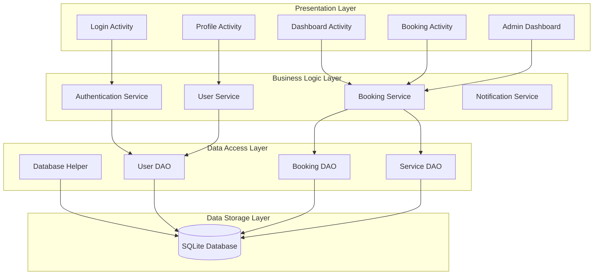

# TechCare Services Mobile Application - System Design Documentation

## 1. Use Case Diagram

### Explanation:
The use case diagram shows the main interactions between different actors (Customer, Admin, System) and the functionalities they can perform. This helps identify the key features and user roles in the system.

### Design Decisions:
- **Customer Actor**: Primary user who books services, manages profile, and tracks repairs
- **Admin Actor**: Manages services, bookings, and system maintenance
- **System Actor**: Represents automated processes like notifications and updates
- **Include/Extend Relationships**: Show dependencies between use cases

```mermaid
graph TB
    subgraph "TechCare Services System"
        subgraph "Customer Functions"
            UC1[Register Account]
            UC2[Login]
            UC3[Browse Services]
            UC4[Submit Repair Request]
            UC5[Schedule Pickup/Dropoff]
            UC6[Track Booking Status]
            UC7[Manage Profile]
            UC8[View Service History]
            UC9[Change Password]
            UC10[View FAQs]
            UC11[Contact Support]
            UC12[Cancel Booking]
        end
        
        subgraph "Admin Functions"
            UC13[Admin Login]
            UC14[Manage Services]
            UC15[View All Bookings]
            UC16[Update Booking Status]
            UC17[Manage Customer Accounts]
            UC18[Generate Reports]
        end
        
        subgraph "System Functions"
            UC19[Send Notifications]
            UC20[Update Status Automatically]
            UC21[Backup Data]
        end
    end
    
    Customer((Customer))
    Admin((Admin))
    System((System))
    
    Customer --> UC1
    Customer --> UC2
    Customer --> UC3
    Customer --> UC4
    Customer --> UC5
    Customer --> UC6
    Customer --> UC7
    Customer --> UC8
    Customer --> UC9
    Customer --> UC10
    Customer --> UC11
    Customer --> UC12
    
    Admin --> UC13
    Admin --> UC14
    Admin --> UC15
    Admin --> UC16
    Admin --> UC17
    Admin --> UC18
    
    System --> UC19
    System --> UC20
    System --> UC21
    
    UC4 -.->|includes| UC2
    UC5 -.->|includes| UC4
    UC6 -.->|includes| UC2
    UC7 -.->|includes| UC2
    UC8 -.->|includes| UC2
    UC12 -.->|includes| UC6
    UC16 -.->|extends| UC19
```



## 2. Class Diagram

### Explanation:
The class diagram represents the object-oriented structure of the application, showing classes, their attributes, methods, and relationships. This provides the blueprint for the code implementation.

### Design Decisions:
- **User Class**: Base class for authentication and profile management
- **Customer Class**: Inherits from User, adds customer-specific functionality
- **Admin Class**: Inherits from User, adds admin privileges
- **Service Class**: Represents repair services offered
- **Booking Class**: Core entity managing repair requests
- **Device Class**: Categorizes different types of devices
- **DatabaseHelper**: Manages SQLite operations



## 3. Activity Diagram - Customer Booking Process

### Explanation:
This activity diagram shows the flow of activities when a customer submits a repair request. It includes decision points, parallel activities, and error handling.

### Design Decisions:
- **Sequential Flow**: User must be logged in before booking
- **Decision Points**: Service type affects workflow
- **Parallel Activities**: Photo upload is optional
- **Error Handling**: Validation failures return to previous steps



## 4. Entity-Relationship (ER) Diagram

### Explanation:
The ER diagram shows the conceptual design of the database, including entities, attributes, and relationships. This forms the basis for the normalized relational schema.

### Design Decisions:
- **One-to-Many Relationships**: Customer can have multiple bookings and devices
- **Many-to-One Relationships**: Multiple bookings can use the same service
- **Weak Entities**: Some entities depend on others for identification
- **Attribute Types**: Primary keys (PK), Foreign keys (FK), and regular attributes



## 5. Normalized Relational Schema (3NF)

### Explanation:
The normalized database schema eliminates redundancy and ensures data integrity through normalization to Third Normal Form (3NF).

### Design Decisions:
- **1NF**: All attributes contain atomic values
- **2NF**: All non-key attributes depend on the entire primary key
- **3NF**: No transitive dependencies between non-key attributes
- **Referential Integrity**: Foreign key constraints maintain data consistency

### Tables:

#### 1. Users Table
```sql
CREATE TABLE users (
    user_id INTEGER PRIMARY KEY AUTOINCREMENT,
    email TEXT UNIQUE NOT NULL,
    phone TEXT UNIQUE NOT NULL,
    password TEXT NOT NULL,
    name TEXT NOT NULL,
    user_type TEXT CHECK(user_type IN ('customer', 'admin')) NOT NULL,
    created_at DATETIME DEFAULT CURRENT_TIMESTAMP,
    is_active BOOLEAN DEFAULT 1
);
```

#### 2. Customers Table
```sql
CREATE TABLE customers (
    customer_id INTEGER PRIMARY KEY AUTOINCREMENT,
    user_id INTEGER NOT NULL,
    address TEXT,
    preferred_contact TEXT CHECK(preferred_contact IN ('email', 'phone', 'both')),
    FOREIGN KEY (user_id) REFERENCES users(user_id) ON DELETE CASCADE
);
```

#### 3. Admins Table
```sql
CREATE TABLE admins (
    admin_id INTEGER PRIMARY KEY AUTOINCREMENT,
    user_id INTEGER NOT NULL,
    department TEXT,
    role TEXT,
    last_login DATETIME,
    FOREIGN KEY (user_id) REFERENCES users(user_id) ON DELETE CASCADE
);
```

#### 4. Services Table
```sql
CREATE TABLE services (
    service_id INTEGER PRIMARY KEY AUTOINCREMENT,
    service_name TEXT NOT NULL,
    description TEXT,
    price DECIMAL(10,2) NOT NULL,
    category TEXT NOT NULL,
    estimated_days INTEGER DEFAULT 1,
    is_active BOOLEAN DEFAULT 1,
    created_at DATETIME DEFAULT CURRENT_TIMESTAMP,
    updated_at DATETIME DEFAULT CURRENT_TIMESTAMP
);
```

#### 5. Devices Table
```sql
CREATE TABLE devices (
    device_id INTEGER PRIMARY KEY AUTOINCREMENT,
    customer_id INTEGER NOT NULL,
    device_type TEXT NOT NULL,
    brand TEXT,
    model TEXT,
    serial_number TEXT,
    added_date DATETIME DEFAULT CURRENT_TIMESTAMP,
    FOREIGN KEY (customer_id) REFERENCES customers(customer_id) ON DELETE CASCADE
);
```

#### 6. Bookings Table
```sql
CREATE TABLE bookings (
    booking_id INTEGER PRIMARY KEY AUTOINCREMENT,
    customer_id INTEGER NOT NULL,
    service_id INTEGER NOT NULL,
    device_id INTEGER NOT NULL,
    issue_description TEXT NOT NULL,
    service_type TEXT CHECK(service_type IN ('pickup', 'drop-off')) NOT NULL,
    status TEXT CHECK(status IN ('pending', 'confirmed', 'in_progress', 'completed', 'cancelled')) DEFAULT 'pending',
    total_cost DECIMAL(10,2),
    request_date DATETIME DEFAULT CURRENT_TIMESTAMP,
    scheduled_date DATETIME,
    completion_date DATETIME,
    technician_notes TEXT,
    payment_status TEXT CHECK(payment_status IN ('pending', 'paid', 'refunded')) DEFAULT 'pending',
    FOREIGN KEY (customer_id) REFERENCES customers(customer_id) ON DELETE CASCADE,
    FOREIGN KEY (service_id) REFERENCES services(service_id),
    FOREIGN KEY (device_id) REFERENCES devices(device_id)
);
```

#### 7. FAQs Table
```sql
CREATE TABLE faqs (
    faq_id INTEGER PRIMARY KEY AUTOINCREMENT,
    question TEXT NOT NULL,
    answer TEXT NOT NULL,
    category TEXT,
    is_active BOOLEAN DEFAULT 1,
    created_at DATETIME DEFAULT CURRENT_TIMESTAMP
);
```

#### 8. Contact Support Table
```sql
CREATE TABLE contact_support (
    contact_id INTEGER PRIMARY KEY AUTOINCREMENT,
    customer_id INTEGER NOT NULL,
    subject TEXT NOT NULL,
    message TEXT NOT NULL,
    status TEXT CHECK(status IN ('open', 'in_progress', 'resolved', 'closed')) DEFAULT 'open',
    created_at DATETIME DEFAULT CURRENT_TIMESTAMP,
    resolved_at DATETIME,
    admin_response TEXT,
    FOREIGN KEY (customer_id) REFERENCES customers(customer_id) ON DELETE CASCADE
);
```

## 6. System Architecture Overview

### Explanation:
The system follows a layered architecture with clear separation of concerns.

### Design Decisions:
- **Presentation Layer**: Android Activities and Fragments
- **Business Logic Layer**: Service classes and data models
- **Data Access Layer**: SQLite database with helper classes
- **Security Layer**: Authentication and authorization



This comprehensive system design ensures:
1. **Scalability**: Clear separation allows for easy maintenance and updates
2. **Security**: User authentication and data validation at multiple layers
3. **Usability**: Intuitive user interface with proper error handling
4. **Data Integrity**: Normalized database with referential constraints
5. **Maintainability**: Modular design with clear responsibilities
